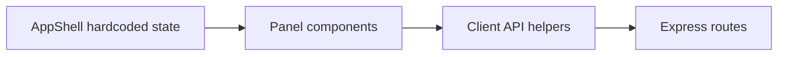
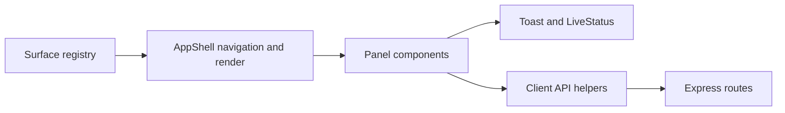
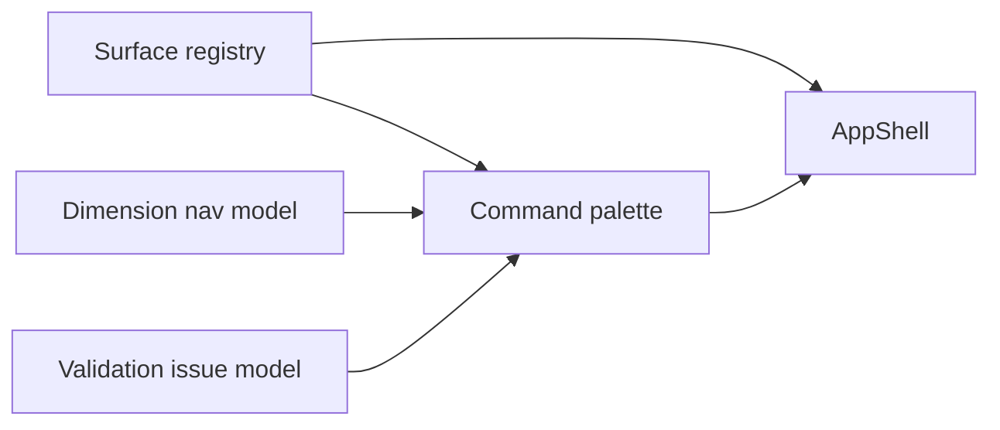

# UI/UX Upgrade To 8 - Design Spec

**Status:** Draft for user review  
**Date:** 2026-06-28  
**Authors:** dimbuilder delivery team  
**Source review:** `docs/UI_UX_INTERFACE_REVIEW_V2.md`

## Problem

OneStream Dimension Builder has a credible core workspace, but the full interface does not yet match the product contract in `PRODUCT.md` and `DESIGN.md`.

The current review rating is **6.2 / 10**. The application is usable in controlled flows, especially project overview, dimension workspace, validation, import/export, and reporting. It does not yet feel like a reliable full-lifecycle platform because the interface has drifted from its own design and product rules:

| Area | Current signal |
|---|---|
| Responsive navigation | At tablet/mobile breakpoints, users can reach dimensions but lose feature surfaces such as Validation, Reports, Audit, Admin, and Config |
| Platform IA | `AppShell` hardcodes nav constants and render branches while many implemented platform panels are not discoverable |
| Chat assistant | The shipped UI uses robot icons, suggestion chips, chat bubbles, alternating alignment, and typing dots despite explicit anti-references |
| Feedback | `ToastProvider` exists but routine status still uses banners, badges, and modal text inconsistently |
| Modal behavior | `ConfirmDialog` has focus trapping; import/export/project modals do not share the same accessibility contract |
| Accessibility | Visual tabs, clickable table rows, async status, and some pseudo-buttons are incomplete for keyboard and assistive technology users |
| Tokens and CSS | `styles.css` references undefined or legacy CSS variables such as `--fg`, `--bg-alt`, and `--surface-hover` |
| Toolbar | Global toolbar exposes too many primary-looking actions and includes disabled Undo/Redo placeholders |
| AI Insights | The data is useful, but the panel frames the feature around "AI" instead of metadata findings |

The target is to lift the interface to a credible **8.0 to 8.3** first, then create a clear second wave toward **9.0**.

## Goals

1. Make every enabled core surface reachable on desktop, tablet, and mobile.
2. Replace hardcoded shell navigation with a typed surface registry.
3. Rebuild the chat assistant as a command/result interface that matches `DESIGN.md`.
4. Unify transient and inline feedback around accessible status patterns.
5. Centralize modal behavior in one shared modal primitive.
6. Repair high-impact accessibility gaps in tabs, table navigation, status updates, and pseudo-buttons.
7. Reduce toolbar clutter and remove dead affordances.
8. Remove unresolved CSS token drift.
9. Reframe AI Insights around metadata signals rather than AI branding.
10. Add regression tests that protect the interface contracts.

## Non-Goals

- Do not replace the React/Vite/vanilla CSS stack.
- Do not adopt a new component library.
- Do not redesign the whole visual language from scratch.
- Do not make every platform panel a top-level nav item.
- Do not implement real Undo/Redo in this pass.
- Do not change backend API contracts unless required for command palette search in the later wave.
- Do not change database schema.
- Do not move the app to route-based React Router navigation in this first wave.
- Do not attempt to polish every secondary panel before the shell, feedback, and accessibility contracts are fixed.

## Recommendation

Use a **surgical trust-first upgrade**.

This means:

1. Fix the interface truths first: reachability, feedback, modal behavior, Chat contract, and keyboard access.
2. Keep the current design system and core workspace.
3. Add a small number of high-leverage primitives: surface registry, modal, live status, accessible tabs, overflow menu.
4. Defer broad visual polish until the app behaves like the platform it claims to be.

This path is lower risk than a full shell redesign and higher impact than a pure accessibility refactor.

## Alternatives Considered

### Alternative A: Full shell redesign

Rebuild `AppShell`, navigation, toolbar, and major panel layouts in one coordinated redesign.

Pros:

- Highest possible visual upside.
- Could solve IA and visual rhythm together.

Cons:

- High regression risk.
- Harder to review.
- More likely to disturb stable workspace behavior.
- Does not guarantee accessibility unless primitives are designed first.

Decision: reject for the first implementation wave.

### Alternative B: Accessibility/system primitives first

Build Modal, Tabs, Toast, Status, CommandPalette, SurfaceRegistry, and menu primitives before touching visible flows.

Pros:

- Cleanest architecture.
- Strong long-term maintainability.

Cons:

- Slower visible improvement.
- Users still see broken mobile nav and Chat while primitives are being built.

Decision: use selected primitives, but do not make this a purely internal refactor.

### Alternative C: Surgical trust-first upgrade

Fix blockers and introduce primitives only where they directly remove user-facing issues.

Pros:

- Fastest credible path to an 8.
- Lower regression risk.
- Keeps work aligned with V2 review findings.
- Produces visible improvement early.

Cons:

- Some secondary panels remain visually uneven until Wave B.
- Compatibility layers may remain temporarily.

Decision: recommended.

## Target Information Architecture

The app should treat surfaces as typed product capabilities, not hardcoded JSX branches in `AppShell`.

Add a client-side registry:

```ts
export type SurfaceGroup = "build" | "validate" | "analyze" | "govern" | "deploy" | "admin";
export type SurfacePriority = "primary" | "secondary" | "utility";

export interface SurfaceDefinition {
  id: string;
  label: string;
  shortLabel?: string;
  group: SurfaceGroup;
  priority: SurfacePriority;
  requiresProject: boolean;
  moduleGate?: (appConfig: ClientAppConfig) => boolean;
  keywords: string[];
  description: string;
  render: (context: SurfaceRenderContext) => ReactNode;
}
```

Initial groups:

| Group | Surfaces |
|---|---|
| Build | Project Overview, Dimensions, Blueprint Studio, Import |
| Validate | Validation, Quality, Metadata Signals |
| Analyze | Reports, Risk Heatmap, Pattern Profiler, XD X-Ray, POV Simulator |
| Govern | Audit Log, Snapshots, Change Sets, Workflows, Impact Analysis |
| Deploy | Export, Environment, Migration Cockpit, Connectors, Artifact Scanner |
| Admin | Admin, Config |

The first implementation should only route surfaces that already have viable components or clear existing flows. Surfaces can be registered as disabled or hidden based on config and readiness, but the rules must be explicit.

## App Shell Design

### Desktop

Desktop keeps the existing high-productivity structure:

- Global toolbar at the top.
- Secondary feature nav below toolbar.
- Dimension sidebar for dimension switching.
- Main content region.

Changes:

- Secondary feature nav is generated from `surfaceRegistry`.
- Primary nav contains only the highest frequency surfaces.
- Secondary and utility surfaces move to a grouped "Tools" or "More" menu.
- Active surface state uses registry ids instead of hardcoded constants.
- Dimension selection remains in the sidebar, but dimensions also appear in the command palette in Wave B.

### Tablet and mobile

The current mobile select only lists Project Overview and dimensions. Replace it with a proper workspace switcher.

The switcher must include:

- Primary feature surfaces.
- Grouped tools.
- Project dimensions.
- Admin and Config when allowed.

At `max-width: 1024px`:

- The dimension sidebar may remain hidden.
- The secondary desktop nav may be hidden.
- An equivalent mobile navigation path must remain visible.
- Feature surfaces must not disappear.

Acceptance:

- At `375`, `768`, `1024`, and `1440`, users can navigate to Project Overview, Validation, Reports, Metadata Signals, Quality when enabled, Audit Log when enabled, Assistant when enabled, Admin, Config, and every dimension.

## Toolbar Design

The toolbar should become a command surface, not a shelf of every action.

Visible actions:

- New Project
- Open
- Validate
- Export

Overflow actions:

- Seed from file
- Save snapshot
- Save As
- Clear Session
- Import/export utilities
- Admin/config utilities where appropriate

Remove:

- Disabled Undo
- Disabled Redo

Add project context:

- Current project name or "No project open"
- Readiness badge: Ready, Needs review, Export blocked, No project
- Optional short source/last snapshot line if already available

Rules:

- Primary actions stay visible only if they are frequent and safe.
- Destructive or session-ending actions belong in overflow.
- Disabled placeholders are not shown unless they teach the user something actionable.

## Surface Registry Behavior

`AppShell` should derive:

- Desktop nav items.
- Mobile switcher items.
- Active surface render.
- Empty states for project-required surfaces.
- Search metadata for the command palette in Wave B.

Surface availability states:

```ts
type SurfaceAvailability =
  | { state: "available" }
  | { state: "requiresProject" }
  | { state: "disabledByConfig"; reason: string }
  | { state: "notReady"; reason: string };
```

The render layer should show an intentional unavailable state for `requiresProject`, `disabledByConfig`, or `notReady` when a user reaches that surface through a menu or command palette.

## Chat Assistant Redesign

Rename the visible nav label from `Chat` to `Assistant` or `Query`. Recommended label: **Assistant** for nav, with page title **Project Query**.

Remove:

- `Bot` icon.
- `User` avatar icon.
- Chat bubbles.
- Left/right message alignment.
- Quick query suggestion chips.
- Typing dots.
- Consumer chat welcome copy.

Add:

- A command input with the same styling as product inputs.
- Query history as muted command blocks.
- Response area with structured sections.
- `[pending]` status badge while request is active.
- Inline error block on failure.
- Matched members as action rows or compact result chips.
- Evidence/metadata sections when returned by the API.

Visual structure:

```text
Project Query
[status badge]

Command
> what's blocking export?

Result
Export is blocked by 12 validation errors across Account and Entity.

Findings
Severity | Dimension | Rule | Count | Action

Input
[ Ask about members, dimensions, validation, export readiness... ][Run]
```

Behavior:

- Press Enter submits.
- Disable submit while loading.
- If loading, show `[pending]` rather than animation.
- If failed, show a danger inline status and preserve the query.
- If matched members are returned, expose explicit "Open" actions.

Acceptance:

- No chat bubble classes remain.
- No robot/user chat iconography remains.
- No suggestion chips remain.
- Loading and errors are accessible.
- The surface matches `DESIGN.md` section 6.

## Metadata Signals Redesign

Rename visible `AI Insights` to **Metadata Signals**.

Remove:

- `Brain` icon.
- "AI-Powered Intelligence" kicker.
- Any copy that implies "AI found this" as the value proposition.

Keep:

- Duplicate detection.
- Naming anomalies.
- Hierarchy suggestions.
- Confidence values.

Improve:

- Use accessible tabs or a segmented control.
- Show each finding as a row: signal badge, finding, evidence, confidence, action.
- Empty states should say what was checked, not celebrate AI.

Example row:

```text
Warning | Naming anomaly | Account 64000 breaks OPEX naming pattern | 84% confidence | Open
```

Acceptance:

- Panel centers metadata findings.
- The word "AI" is absent from visible panel framing unless required by a config label.
- Tabs satisfy keyboard and ARIA expectations.

## Feedback Architecture

Add or standardize three feedback primitives.

### Toast

For transient completion:

- Project created.
- Project loaded.
- Import complete.
- Export ready.
- Snapshot saved.
- Validation complete.

Toast rules:

- Success/info auto-dismiss.
- Danger does not auto-dismiss or uses longer duration.
- Toasts include text, not icon-only signals.
- Toasts use `aria-live`.

### Inline status

For local operations near controls:

- Grid load/save/delete.
- Modal import preview.
- Export preparation.
- Blueprint validation.

Inline status rules:

- Use `role="status"` and `aria-live="polite"` for progress and success.
- Use `role="alert"` for errors.
- Do not use `StatusBadge` alone for async operation results unless wrapped by an announcing region.

### Banner

For persistent blocking conditions:

- Configuration failed to load.
- Store-level fatal errors.
- Export blocked by validation when the current surface is export-focused.

Banner rules:

- Must include semantic role.
- Must not be used for routine success.

Acceptance:

- `useToast()` is called by user-facing workflows.
- `AppShell` no longer renders routine status as generic banners.
- Async statuses are announced.

## Modal Primitive

Create a shared `Modal` component and migrate existing modals.

Required API:

```ts
interface ModalProps {
  open: boolean;
  title: string;
  description?: string;
  size?: "sm" | "md" | "lg";
  initialFocusRef?: RefObject<HTMLElement>;
  closeOnEscape?: boolean;
  closeOnBackdrop?: boolean;
  onClose: () => void;
  children: ReactNode;
  footer?: ReactNode;
}
```

Behavior:

- Trap focus while open.
- Move focus to initial focus target or first focusable control.
- Return focus to launching control on close.
- Close on Escape when allowed.
- Lock page scroll while open.
- Stop propagation from dialog body to backdrop.
- Use `role="dialog"` and `aria-modal="true"`.
- Use `role="alertdialog"` only for destructive confirmations.

Migrate:

- `CreateProjectModal`
- `ImportModal`
- `ExportModal`
- `OpenProjectModal`
- `SaveAsModal`
- `ConfirmDialog`

Acceptance:

- Keyboard cannot tab outside any modal.
- Escape works consistently for non-destructive modals.
- Focus return works after close.
- Modal markup is centralized.

## Accessibility Repairs

### Validation filters

Replace clickable `div` cards with native `button` controls or a segmented control.

Rules:

- Use `aria-pressed` for toggle filters.
- Keep counts visible.
- Keep current filter text near the table.

### Clickable table rows

Do not rely on `tr onClick` alone.

Options:

1. Add explicit "Open" buttons in table rows.
2. Make the first cell contain a button-styled link.
3. Add keyboard handlers and focus styles to rows only if a row interaction pattern is fully implemented.

Recommendation: explicit row actions.

### Tabs

Create an `AccessibleTabs` primitive or local hook.

Requirements:

- `role="tablist"`.
- `role="tab"`.
- `aria-selected`.
- `aria-controls`.
- Arrow keys move focus.
- Enter/Space activates when focus and activation are separate.

Use for:

- Metadata Signals tabs.
- Any future visual tab surfaces.

### Live statuses

Add `LiveStatus` or `StatusRegion`:

```tsx
<LiveStatus tone="info">{status}</LiveStatus>
```

Requirements:

- Announces changes.
- Keeps visual styling consistent with badges or inline status text.
- Uses `role="status"` for non-errors.
- Uses `role="alert"` for errors.

Acceptance:

- Keyboard-only flows cover validation filters, table row navigation, tabs, modals, toolbar, mobile switcher, and assistant submit.

## CSS Token Cleanup

Short-term: add compatibility aliases in `:root` and `[data-theme="dark"]` for legacy names.

Aliases:

```css
--fg: var(--text);
--bg-alt: var(--surface-muted);
--surface-hover: var(--surface-subtle);
--bg-subtle: var(--surface-subtle);
--border-default: var(--border);
--text-muted: var(--muted);
```

Then migrate usages to canonical tokens:

- `--text`
- `--muted`
- `--surface`
- `--surface-subtle`
- `--surface-muted`
- `--border`
- `--border-strong`

Add a token audit test or script that flags unresolved custom property references.

Acceptance:

- No unresolved authored CSS custom properties remain.
- Light and dark mode render Chat/Assistant, KPI, Workflow, and Reporting surfaces without invalid CSS fallbacks.

## Visual Rhythm Cleanup

This wave should not become a full visual redesign, but it should remove the most obvious generated-template patterns.

Changes:

- Reduce `section-kicker` usage on obvious headings.
- Keep kickers only where category disambiguation helps.
- Replace Validation summary cards with compact filters.
- Keep ScoreRing as a signature component only where it represents real score/readiness.
- Tighten toolbar and header spacing after action reduction.

Acceptance:

- Repeated page headings feel less templated.
- Validation dashboard is more table/filter-led.
- No change reduces information density.

## Command Palette - Wave B

Command palette is the bridge from an 8 to a 9. It should be planned now but implemented after surface registry exists.

Capabilities:

- Open surface.
- Open dimension.
- Jump to validation issue.
- Run Validate.
- Open Export.
- Open Import/Seed.
- Save snapshot.
- Search by aliases and keywords from registry.

Shortcut:

- `Ctrl+K` on Windows/Linux.
- `Cmd+K` on macOS.

Design:

- Modal or popover using shared modal/focus infrastructure.
- Keyboard-first listbox.
- Results grouped by Surfaces, Dimensions, Issues, Actions.
- No fuzzy-search dependency in the first pass unless already available or trivial to implement.

Acceptance:

- Power users can navigate without using sidebar or secondary nav.
- Mobile users can access the palette through the workspace switcher or toolbar button.

## Implementation Waves

### Wave A: Credible 8.0 to 8.3

#### Phase A1: Surface registry and responsive navigation

Files likely touched:

- `src/client/ui/surfaceRegistry.tsx`
- `src/client/components/AppShell.tsx`
- `src/client/styles.css`
- `src/client/ui/viewModel.ts`
- focused tests under `src/test`

Tasks:

1. Define `SurfaceDefinition`, `SurfaceGroup`, and availability helpers.
2. Register current reachable surfaces.
3. Move nav rendering to registry.
4. Move active surface rendering to registry.
5. Replace mobile dimension-only select with a grouped workspace switcher.
6. Keep dimension sidebar behavior for desktop.
7. Add tests for available/gated surfaces.

Acceptance:

- Feature surfaces remain reachable at `375`, `768`, `1024`, and `1440`.
- `AppShell` no longer owns a hardcoded list of feature nav buttons.
- Project-required surfaces show intentional empty states.

#### Phase A2: Chat command interface

Files likely touched:

- `src/client/components/ChatPanel.tsx`
- `src/client/styles.css`
- `DESIGN.md` only if the design contract needs clarification

Tasks:

1. Rename visible labels.
2. Remove bubble/avatar/typing/suggestion patterns.
3. Render query/result blocks.
4. Add pending badge and inline error state.
5. Preserve matched member navigation.
6. Add tests or snapshots for forbidden class/icon removal.

Acceptance:

- Chat matches `DESIGN.md`.
- No consumer chat patterns remain.

#### Phase A3: Feedback architecture

Files likely touched:

- `src/client/components/Toast.tsx`
- `src/client/components/AppShell.tsx`
- `src/client/components/ui.tsx`
- `src/client/components/ImportExportModals.tsx`
- grid and workflow components with local statuses

Tasks:

1. Add `LiveStatus` or `StatusRegion`.
2. Wire `useToast()` into AppShell workflows.
3. Convert routine status banners to toasts or live inline status.
4. Add alert/status roles to modal statuses.
5. Standardize error handling for export/import.

Acceptance:

- Routine success uses toast.
- Progress is announced.
- Persistent errors use banners or alerts.

#### Phase A4: Modal primitive

Files likely touched:

- `src/client/components/Modal.tsx`
- `src/client/components/ConfirmDialog.tsx`
- `src/client/components/ImportExportModals.tsx`
- `src/client/hooks/useFocusTrap.ts`
- `src/client/styles.css`

Tasks:

1. Build shared Modal.
2. Ensure focus trap and return.
3. Add scroll lock.
4. Migrate project/import/export/open/save-as modals.
5. Migrate ConfirmDialog or wrap it in Modal alertdialog mode.
6. Add tests for focus behavior where feasible.

Acceptance:

- Modal behavior is consistent.
- Keyboard access is reliable.

#### Phase A5: Toolbar refactor

Files likely touched:

- `src/client/components/AppShell.tsx`
- `src/client/styles.css`
- `src/client/ui/viewModel.ts`

Tasks:

1. Add project context block.
2. Move secondary actions into overflow.
3. Remove disabled Undo/Redo.
4. Preserve all current workflows.
5. Verify toolbar wraps cleanly at tablet width.

Acceptance:

- Toolbar is calmer.
- No action disappears entirely.
- Project state is visible.

#### Phase A6: Accessibility repairs

Files likely touched:

- `src/client/components/ValidationDashboard.tsx`
- `src/client/components/AIInsightsPanel.tsx`
- `src/client/components/AccessibleTabs.tsx`
- `src/client/components/ui.tsx`
- tests

Tasks:

1. Convert validation cards to native filter buttons.
2. Add explicit row actions in validation tables.
3. Add accessible tabs.
4. Use tabs in Metadata Signals.
5. Add live statuses where async badges change.

Acceptance:

- Keyboard-only users can operate the same critical workflows.

#### Phase A7: Token cleanup and AI Insights reframing

Files likely touched:

- `src/client/styles.css`
- `src/client/components/AIInsightsPanel.tsx`
- `src/client/components/KPICards.tsx`
- `src/client/components/WorkflowPanel.tsx`
- `index.html`

Tasks:

1. Add compatibility aliases.
2. Replace known stale token references.
3. Rename AI Insights to Metadata Signals.
4. Remove Brain icon and AI kicker.
5. Align static app title/metadata.

Acceptance:

- No unresolved token drift in authored CSS.
- AI Insights no longer feels AI-branded.

### Wave B: 8.3 to 9.0

#### Phase B1: Command palette

Build on the surface registry and modal primitive.

Tasks:

1. Add command palette component.
2. Add keyboard shortcut.
3. Index surfaces, dimensions, actions, and validation issues.
4. Add grouped result list.
5. Add tests for keyboard interaction.

#### Phase B2: Secondary platform panel consistency

Tasks:

1. Route intentionally selected orphaned panels.
2. Migrate static inline styles to CSS classes.
3. Standardize panel headings, empty states, filter bars, and action rows.
4. Add "not configured" states for environment/connectors.

#### Phase B3: Visual rhythm polish

Tasks:

1. Reduce section kickers by roughly 50 to 70 percent.
2. Simplify validation summary cards into compact filters.
3. Make report/quality dashboards more table-led.
4. Audit icon sizing and stroke consistency.
5. Verify dark and light mode visually.

## Data Flow Impact

Most of Wave A is client-side UI architecture. Backend API contracts remain stable.

Current flow:



Target Wave A flow:



Target Wave B flow:



## Testing Strategy

### Unit and component-level tests

Add tests for:

- Surface registry availability and grouping.
- Mobile switcher item construction.
- Toolbar action grouping.
- Validation filter state.
- Metadata Signals tab state.
- Token audit.

### Playwright smoke tests

Run rendered checks at:

- `375 x 800`
- `768 x 1024`
- `1024 x 768`
- `1440 x 900`

Verify:

- Feature surfaces are reachable.
- Dimensions remain reachable.
- Toolbar does not overlap.
- Modal focus trap works.
- Assistant renders command/result UI.
- Metadata Signals renders non-AI-branded heading.
- No console errors.

### Accessibility-focused tests

Verify:

- Keyboard opens and operates mobile switcher.
- Keyboard operates validation filters.
- Keyboard can activate validation row actions.
- Tabs expose ARIA semantics.
- Modal traps focus and returns focus.
- Async statuses use `role="status"` or `role="alert"`.

### Standard verification

Minimum:

```powershell
npm.cmd test
npm.cmd run build
npm.cmd run docs:check
```

Rendered UI verification should use Playwright with screenshots after Wave A phases that affect layout.

## Documentation Impact

Update during implementation:

- `docs/feature-catalog.md` for navigation and surface discoverability changes.
- `docs/application-summary.md` for shell behavior and workflows.
- `docs/current-state-baseline.md` for resolved UI gaps.
- `docs/testing-strategy.md` for Playwright/a11y checks.
- `DESIGN.md` only if the design contract needs clarification.
- `docs/UI_UX_INTERFACE_REVIEW_V2.md` can remain as the audit source, not a living status document.

## Rollback Strategy

Each phase should be independently revertible.

| Phase | Rollback approach |
|---|---|
| Surface registry | Keep compatibility helpers so AppShell can temporarily render old surface constants if needed |
| Responsive navigation | Mobile switcher CSS/JS can revert while registry remains |
| Chat redesign | Component-local rollback; API contract unchanged |
| Feedback architecture | Toast wiring can revert per workflow |
| Modal primitive | Migrate one modal at a time and keep old modal markup until each is done |
| Toolbar | Overflow grouping can revert without backend changes |
| Accessibility tabs | Component-local rollback |
| Token cleanup | Compatibility aliases make rollback low risk |

## Risks And Mitigations

| Risk | Mitigation |
|---|---|
| Registry refactor changes navigation behavior | Add registry tests before replacing AppShell branches |
| Mobile switcher becomes too dense | Group surfaces and dimensions; keep search/command palette for Wave B |
| Chat redesign removes useful prompts | Do not remove querying capability; only remove suggestion-chip UI |
| Toasts become noisy | Use toasts only for completion; keep progress inline |
| Modal migration breaks import/export flows | Migrate modal wrapper first without changing internal flow logic |
| Accessibility changes alter visual layout | Use native controls styled to current design tokens |
| Token aliases hide future drift | Add audit test after aliases are in place |
| Secondary panels remain uneven after Wave A | Explicitly schedule panel consistency in Wave B |

## Acceptance Criteria For 8.0

The interface can be considered an 8 when:

1. Feature surfaces and dimensions are reachable at desktop, tablet, and mobile sizes.
2. `AppShell` navigation is registry-driven.
3. Chat is rebuilt as a command/result interface and no longer violates `DESIGN.md`.
4. Routine workflow success uses toast feedback.
5. Async inline statuses are announced.
6. All major modals use a shared focus/escape/return behavior.
7. Validation filters, validation row navigation, and Metadata Signals tabs are keyboard accessible.
8. Toolbar no longer includes dead Undo/Redo placeholders.
9. CSS token drift is resolved or covered by documented aliases.
10. AI Insights is reframed as Metadata Signals.
11. Build, tests, docs check, and rendered responsive smoke checks pass.

## Acceptance Criteria For 9.0

The interface can be considered a 9 when:

1. Command palette provides fast access to surfaces, dimensions, issues, and common actions.
2. Secondary platform panels are intentionally routed and visually consistent.
3. Inline style usage is limited to dynamic geometry or measured values.
4. Visual rhythm no longer depends on repeated section kickers and generic metric cards.
5. Light and dark themes have been visually checked across primary and secondary surfaces.
6. Accessibility claims are backed by automated and manual keyboard verification.
7. Product docs, design docs, and shipped UI describe the same product.

## Implementation Sequence

Recommended order:

1. Surface registry and responsive navigation.
2. Chat command-panel rebuild.
3. Toast/live status architecture.
4. Shared Modal primitive.
5. Toolbar refactor.
6. Accessible validation controls and Metadata Signals tabs.
7. Token cleanup.
8. Metadata Signals reframe.
9. Command palette.
10. Secondary panel consistency.
11. Visual rhythm polish.
12. Regression tests and docs sync.

## Spec Self-Review

Placeholder scan: no TBD/TODO placeholders remain.  
Internal consistency: Wave A focuses on the trust-first path to 8; Wave B covers the path to 9.  
Scope check: Wave A is large but separable into independently revertible phases. Implementation should be planned as multiple PR-sized tasks.  
Ambiguity check: surface registry, responsive navigation, Chat redesign, feedback behavior, modal primitive, and acceptance criteria are explicit enough for an implementation plan.
