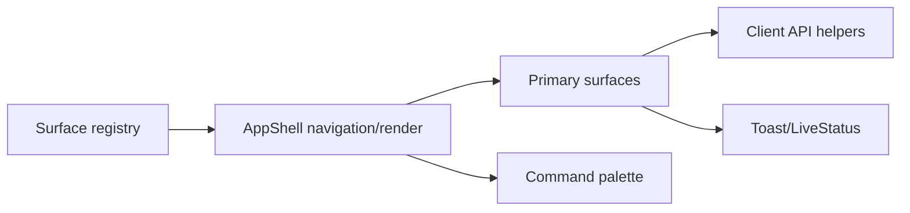
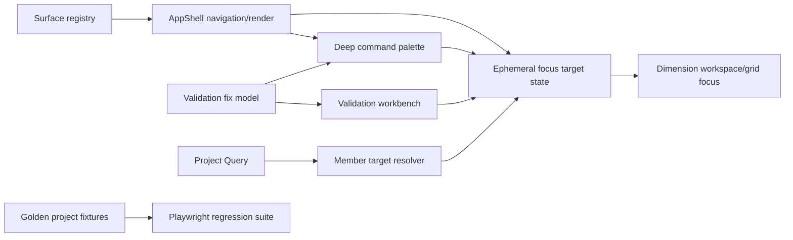
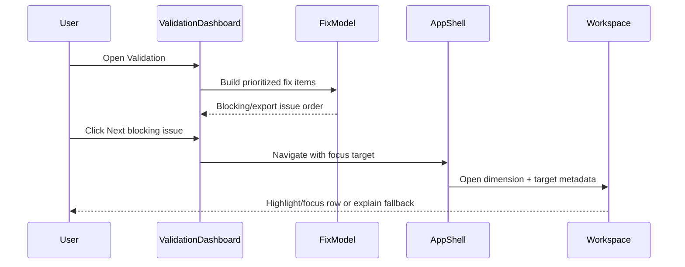
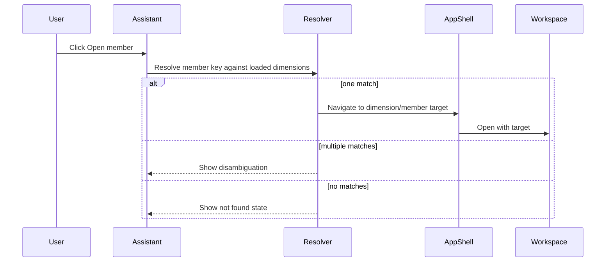

# UI/UX Wave C/D To 9 - Design Spec

**Status:** Draft for user review  
**Date:** 2026-06-28  
**Authors:** dimbuilder delivery team  
**Source reviews:** `docs/UI_UX_INTERFACE_REVIEW_V2.md`, Wave A/B review feedback, `docs/superpowers/specs/2026-06-28-ui-ux-upgrade-to-8-design.md`

## Executive Summary

Wave A/B moved the interface from a fractured 6.2 toward a credible high-7: the shell is calmer, core surfaces are registry-driven, mobile navigation is no longer a dead end, modals/statuses are more consistent, and Chat/AI framing is less consumer-grade.

Wave C/D should not be another broad visual cleanup. The fastest credible path to a 9 is to make the app feel like a senior OneStream implementation partner:

1. It identifies what is blocking export.
2. It tells the user what to fix first.
3. It takes the user directly to the relevant dimension/member/relationship/field whenever the data allows.
4. It keeps power navigation keyboard-first.
5. It proves the experience with seeded realistic data and browser-level regression checks.

Target after Wave C: **8.3 to 8.6**.  
Target after Wave D: **8.8 to 9.2**.

A true 10 remains outside a pure implementation pass. It requires observation of real consultants using real workbooks, telemetry, and iteration on hesitation points.

## Problem

After Wave A/B, the UI is directionally correct but still not world-class. Remaining gaps are mostly workflow trust and proof gaps:

| Area | Remaining problem |
|---|---|
| Assistant navigation | Matched member actions can open the wrong place because the click handler does not resolve the target member to an actual dimension/member row. |
| Accessible tabs | Tabs expose ARIA but arrow-key behavior changes selection without reliably moving DOM focus. |
| Import source selector | Import modes visually behave like tabs but do not implement a real tab or segmented-control contract. |
| Command palette semantics | Keyboard behavior works, but the listbox/options markup still leans on interactive buttons inside option roles and the model ignores the supplied `surfaces` input. |
| Validation workflow | Validation reports issues, but it does not yet guide a user through fixing blockers with enough precision. |
| Issue drill-down | Navigation usually opens a dimension, not the exact member, relationship, field, row, or editor context. |
| Primary surface states | Empty, loading, error, disabled-by-config, and no-project states are better but not yet standardized everywhere. |
| Real-data proof | There is no golden project that exercises the core UX states and no browser suite that protects the app against regressions at realistic viewports. |
| Responsive data surfaces | Some tables and dense panels still depend on desktop-style layouts. |
| Documentation parity | Product/design/testing docs need to reflect the Wave C/D interaction model after implementation. |

## Goals

1. Convert validation from a passive report into a guided fix workflow.
2. Make issue navigation as exact as the available data supports.
3. Fix the remaining Wave A/B review findings before adding more surface area.
4. Deepen the command palette into a real expert navigation layer.
5. Add a golden project or golden fixture set that exercises realistic data states.
6. Add browser-level responsive, keyboard, and no-console-error regression checks.
7. Standardize primary surface states across no-project, empty, loading, error, disabled, ready, and blocked conditions.
8. Improve mobile/tablet handling for dense validation/import/export/command surfaces.
9. Keep backend/API changes small and justified by workflow precision.
10. Sync docs so shipped UI, design rules, and product descriptions match.

## Non-Goals

- Do not redesign the entire visual language.
- Do not introduce a new component library.
- Do not migrate to React Router in this pass.
- Do not route every experimental platform panel.
- Do not implement full collaborative review, approval workflow, or deployment automation.
- Do not build a generalized analytics/telemetry platform.
- Do not implement real AI reasoning changes unless existing API responses already support them.
- Do not block Wave C on perfect secondary-panel polish.
- Do not chase a nominal 10 without real user research.

## Recommendation

Use the **Fastest Credible 9** path.

Wave C should make the app operationally smarter: fix the remaining interaction-contract issues, turn validation into a guided fix loop, deepen command search, and make issue-to-editor navigation precise.

Wave D should prove and polish: create a golden project, add browser/a11y regression coverage, harden responsive dense surfaces, normalize surface states, and update docs.

This is better than a deep foundation refactor because the user-perceived score is now limited by "Can I get my work fixed quickly and confidently?", not by the general visual shell. It is also better than demo polish because it improves actual task completion.

## Wave C: Workflow Trust

### C1. Close Remaining Review Findings

Fix the known issues from the Wave A/B review before adding new behavior.

#### Assistant matched-member navigation

Current behavior risks opening the first dimension when the user clicks a matched member. Replace it with target resolution.

Target behavior:

- Matched member action receives the member key.
- The app searches loaded dimensions for that member key.
- If exactly one dimension contains it, navigate to that dimension and request member focus.
- If multiple dimensions contain it, show a compact disambiguation list.
- If no loaded dimension contains it, open the Assistant result in a "not found in loaded dimensions" state and offer global search/import/validation next actions.

Preferred implementation boundary:

- Add a client-side resolver in a focused UI/view-model module.
- Extend dimension navigation state only as much as needed to carry an optional focus target.
- Do not add backend search unless loaded client data is insufficient for existing responses.

Acceptance:

- Clicking `Open <memberKey>` never blindly opens the first dimension.
- Ambiguous member keys are handled intentionally.
- Tests cover found, not found, and ambiguous cases.

#### Accessible tab focus

The tabs primitive should satisfy the actual keyboard contract.

Target behavior:

- Arrow keys move focus to the next/previous tab.
- Home moves focus to the first tab.
- End moves focus to the last tab.
- Activation behavior is explicit. Recommended: automatic activation on arrow move for the current Metadata Signals use case.
- Focus remains on a focusable selected tab after state changes.

Acceptance:

- Keyboard tests prove focus movement.
- `tabIndex` and active focus do not diverge.

#### Import mode selector semantics

The import mode selector should either be real tabs or a segmented control. Recommended: segmented control, because the content changes an input form mode rather than a document tab panel.

Target behavior:

- Use native `button` controls.
- Use `aria-pressed` on the active mode.
- Remove `role="tablist"` unless implementing full tab semantics.
- Preserve mode-switching behavior and disabled states during import/preview.

Acceptance:

- Screen readers do not receive incomplete tab semantics.
- Keyboard users can switch modes with normal button navigation.

#### Command palette ARIA/model cleanup

Target behavior:

- `buildCommandPaletteItems` uses the `surfaces` input it accepts, making tests and future filtering honest.
- Disabled reasons are visible in the result row, not only in `title`.
- Result options avoid nested interactive semantics. Use a listbox/option pattern with active descendant and pointer activation, or use a command-menu button list without claiming listbox semantics. Recommended: command-menu button list for simplicity and reliability.

Acceptance:

- Keyboard behavior remains: open, search, arrow, enter, escape.
- Markup uses one coherent semantic pattern.
- Tests cover disabled reasons and custom surface input.

### C2. Validation Guided Fix Workflow

Validation should become the user's command center for getting from blocked export to ready export.

#### Information architecture

Add a validation workbench layout inside the existing Validation surface:

- Summary strip: Export Ready / Export Blocked / Needs Review, total blockers, warning count, info count.
- Filter bar: Export blockers, Errors, Warnings, Info, All.
- Group selector: By priority, By dimension, By rule, By field.
- Issue list/table: ordered by fix priority.
- Fix detail panel or inline expanded row: why it matters, affected object, suggested next action.

Recommended default view:

1. Export blockers first.
2. Then errors.
3. Then warnings.
4. Then info.

#### Fix-priority model

Create a deterministic client-side issue priority model.

Inputs:

- Severity.
- Whether severity blocks export.
- Dimension type/order.
- Rule code.
- Field name.
- Row/member/relationship identifiers when present.

Output:

```ts
interface ValidationFixItem {
  issueId: string;
  priority: number;
  severity: "error" | "warning" | "info";
  blocksExport: boolean;
  dimensionId: string;
  dimensionLabel: string;
  code: string;
  message: string;
  targetLabel: string;
  targetKind: "member" | "relationship" | "dimension" | "project" | "unknown";
  fieldName?: string;
  rowNumber?: number;
  action: ValidationFixAction;
}
```

#### Fix actions

```ts
type ValidationFixAction =
  | { type: "openDimension"; dimensionId: string }
  | { type: "openMember"; dimensionId: string; memberKey: string; fieldName?: string }
  | { type: "openRelationship"; dimensionId: string; parentKey?: string; childKey?: string; fieldName?: string }
  | { type: "openValidation"; issueId: string }
  | { type: "notResolvable"; reason: string };
```

Target behavior:

- "Open fix" uses the most precise action available.
- "Next blocking issue" jumps to the highest-priority unresolved blocking item.
- If exact focus is not possible, the UI says why and opens the nearest useful context.

Acceptance:

- Users can navigate from Validation to a relevant editing context in one click for common member and relationship issues.
- Unsupported issue targets do not pretend precision.
- Tests cover priority ordering and action resolution.

### C3. Dimension Workspace Focus Targets

Precise validation and assistant navigation requires the dimension workspace to accept optional focus instructions.

Target behavior:

- App shell active workspace state can include optional focus target metadata.
- Dimension workspace receives the target.
- Metadata/member grid attempts to focus or highlight the row/field when present.
- Relationship view attempts to focus or highlight parent/child rows when present.
- If the target is not currently rendered due to virtualization or filtering, the grid scrolls/searches when feasible.
- If exact focus fails, show a local status: "Opened Account. Could not locate member 64000 in the current grid."

Implementation preference:

- Keep focus target state ephemeral.
- Clear the focus target after the target has been consumed or after the user navigates elsewhere.
- Do not persist focus targets in URL/storage in this wave.

Acceptance:

- Validation and Assistant can both request focused navigation.
- Virtualized grids do not lose the target silently.
- Focus/highlight states are visible and keyboard-safe.

### C4. Command Palette Depth

The command palette should become the expert navigation layer.

Indexed item groups:

- Surfaces.
- Dimensions.
- Members, if loaded and count is reasonable.
- Validation issues.
- Actions.
- Recent project actions, if already available in store.

Search behavior:

- Token-based matching is sufficient.
- Keywords should include surface aliases, dimension type/name, rule code, severity, member key, field name, and action synonyms.
- Disabled items show visible reasons.

Required actions:

- Open Project Overview.
- Open Validation.
- Open Reports.
- Open Metadata Signals.
- Open dimension.
- Open validation issue/fix.
- Run validation.
- Seed from file.
- Export metadata.
- Save snapshot.

Acceptance:

- A user can type "blocked", "export", "account errors", "64000", or "validate" and see useful results.
- Command palette never navigates to an unavailable surface without showing why.
- Keyboard behavior is covered by browser tests.

### C5. Primary Surface State Standardization

Create a small set of reusable state patterns for primary surfaces.

States:

- No project.
- Empty project.
- Loading.
- Error.
- Disabled by config.
- Ready.
- Blocked.

Target pattern:

```tsx
<SurfaceState
  state="noProject"
  title="Open or create a project"
  description="Validation, reports, metadata signals, and export readiness appear after a project is open."
  primaryAction={{ label: "Open Project", onClick: openProject }}
  secondaryAction={{ label: "New Project", onClick: createProject }}
/>
```

Acceptance:

- Primary surfaces do not invent one-off empty/error UI.
- Copy is direct and domain-specific.
- State blocks do not look like marketing cards.

## Wave D: Product Proof And Polish

### D1. Golden Project

Create a deterministic golden project or fixture set for UI verification.

It should include:

- At least one clean dimension.
- At least one warning-only dimension.
- At least one export-blocking dimension.
- A metadata-only dimension.
- Duplicate-like member keys or names for Metadata Signals.
- Relationship issues.
- Missing required field issues.
- A project state that is export blocked.
- A second state or fixture that is export ready.

Preferred shape:

- If the app already has seed/import utilities, add a script that creates the golden project through existing domain APIs.
- If database setup is expensive, create JSON fixtures and mocked API responses for Playwright/component tests.
- Keep fixture data small but realistic.

Acceptance:

- Tests can reset to a known UI state.
- Golden data is documented enough for future agents to use without guessing.

### D2. Browser Regression Suite

Add Playwright coverage focused on the product contract rather than screenshots alone.

Viewport matrix:

- `375 x 800`
- `768 x 1024`
- `1024 x 768`
- `1440 x 900`

Core checks:

- App shell renders with no console errors.
- Primary surfaces are reachable.
- Mobile/tablet workspace switcher reaches feature surfaces and dimensions.
- Command palette opens with `Ctrl+K`/`Cmd+K`, searches, arrows, enters, and closes.
- Validation default view shows export blockers first.
- "Next blocking issue" opens a useful target.
- Import modal mode selector is keyboard-operable and semantically coherent.
- Export blocked state shows reason and action.
- Metadata Signals tabs move focus and activate.
- Assistant matched-member navigation does not open the wrong dimension.

Acceptance:

- Browser tests are part of documented verification.
- Failures produce useful screenshots under `C:/tmp` or a repo-local test artifact directory.

### D3. Dense Responsive Surface Polish

Target high-impact dense surfaces:

- Validation workbench.
- Command palette.
- Import CSV preview/mapping.
- Export modal and relationship impact summary.
- Metadata Signals.
- Reports/Quality summary tables.

Responsive rules:

- Tables may remain tables on desktop.
- At small widths, use horizontal scroll only when comparison is essential.
- For action-heavy rows, collapse secondary columns into detail rows or stacked labels.
- Primary action remains reachable without horizontal scroll.
- Text must not overlap, truncate critical labels, or force awkward button wrapping.

Acceptance:

- The golden project is usable at all target viewports.
- No critical action is hidden behind layout overflow.

### D4. Visual Rhythm And CSS Discipline

Do not perform a total CSS rewrite. Tighten only areas that affect perceived quality and maintainability.

Actions:

- Remove remaining repeated section-kicker patterns from obvious headings.
- Normalize primary surface headings and status badges.
- Move static inline styles out of primary surfaces touched by Wave C/D.
- Keep inline styles only for measured geometry, score bars, and dynamic values.
- Audit icon sizes in toolbar, command palette, validation, and modal actions.

Acceptance:

- Primary surfaces feel authored by one product team.
- CSS changes are localized and do not destabilize the whole stylesheet.

### D5. Documentation And Score Re-Review

Update docs after implementation:

- `docs/application-summary.md`
- `docs/feature-catalog.md`
- `docs/current-state-baseline.md`
- `docs/testing-strategy.md`
- `DESIGN.md` if the validation fix workflow becomes a design-system pattern.

Add a short Wave C/D score re-review:

- What improved.
- Remaining blockers to a true 10.
- Browser/a11y evidence.
- Known limitations.

Recommended output:

`docs/UI_UX_INTERFACE_REVIEW_WAVE_C_D.md`

## Architecture

### Current Post-Wave A/B Shape



### Target Wave C/D Shape



### New/Changed Units

| Unit | Responsibility |
|---|---|
| Validation fix model | Convert raw validation issues into prioritized, actionable fix items. |
| Navigation target model | Represent surface/dimension/member/relationship focus targets without overloading string workspace ids. |
| Member target resolver | Resolve matched assistant member keys to concrete dimensions or ambiguity states. |
| Command palette view model | Index surfaces, dimensions, issues, actions, disabled reasons, and optional loaded members. |
| Surface state component | Render consistent no-project/empty/loading/error/disabled/ready/blocked states. |
| Golden project fixture/script | Provide deterministic UI states for browser verification. |
| Playwright UI contract tests | Protect keyboard, responsive, workflow, and no-console-error behavior. |

## Data Flow

### Validation Fix Flow



### Assistant Member Flow



## Testing Strategy

### Unit Tests

Add or extend tests for:

- Validation fix priority ordering.
- Validation fix action resolution.
- Assistant member target resolution.
- Navigation focus target state.
- Command palette indexing and disabled reasons.
- Accessible tabs focus movement.
- Import segmented control semantics.
- Surface state rendering.

### Component/Markup Tests

Assert:

- Import mode selector no longer claims tab semantics unless real tabs are implemented.
- Command palette uses coherent semantics.
- Disabled command reasons are visible.
- Surface states render correct roles/actions.
- Validation workbench renders "Next blocking issue" and export-blocker filters.

### Playwright Tests

Use golden project data where possible.

Required flows:

1. App shell no-console smoke at each viewport.
2. Command palette keyboard flow.
3. Validation "next blocking issue" flow.
4. Assistant matched member navigation/disambiguation.
5. Import mode keyboard flow.
6. Metadata Signals tab keyboard flow.
7. Export blocked explanation flow.
8. Mobile workspace switcher reachability.

### Manual Review

Before calling the score a 9:

- Inspect screenshots at all target viewports.
- Run keyboard-only path for validation blocker to editor.
- Verify dark and light mode on primary surfaces.
- Re-read the Wave C/D review document for honest residual risks.

## Documentation Impact

Update these docs during or after implementation:

- `docs/application-summary.md`: guided validation, command palette, golden verification.
- `docs/feature-catalog.md`: Validation workbench, Assistant target resolution, command palette search.
- `docs/current-state-baseline.md`: Wave C/D resolved gaps and remaining limitations.
- `docs/testing-strategy.md`: golden project and Playwright UI contract tests.
- `DESIGN.md`: only if validation fix workflow and surface states become reusable design-system patterns.
- `docs/UI_UX_INTERFACE_REVIEW_WAVE_C_D.md`: score re-review and evidence.

## Rollback Strategy

Each Wave C/D section should be independently revertible.

| Area | Rollback approach |
|---|---|
| Assistant resolver | Fall back to opening the dimension only, but do not restore first-dimension behavior. |
| Tabs/import semantics | Component-local rollback to existing buttons while preserving accessibility fixes if possible. |
| Validation fix model | Keep old validation dashboard as a simple table if fix model introduces incorrect routing. |
| Focus targets | Ignore focus metadata and open dimensions normally; no data persistence involved. |
| Command palette depth | Disable member/issue indexing while keeping surface/action search. |
| Golden project | Remove test fixture/script without affecting production runtime. |
| Playwright tests | Tests are additive and can be narrowed if unstable. |
| Responsive polish | CSS-only rollback per surface. |

## Risks And Mitigations

| Risk | Mitigation |
|---|---|
| Exact issue targeting is impossible for some issue types | Use nearest useful navigation plus honest fallback copy. |
| Focus targets become stale after grid edits/filtering | Clear target after consume; show local status on failure. |
| Command palette becomes noisy with members | Index loaded members only when count is reasonable; prioritize exact matches. |
| Golden project setup becomes brittle | Prefer deterministic fixtures or existing import/seed APIs; keep data small. |
| Playwright suite becomes slow | Separate fast smoke tests from deeper golden-flow tests. |
| Responsive table changes reduce desktop density | Apply mobile-specific CSS; keep desktop tables dense. |
| Too much CSS cleanup expands scope | Limit CSS discipline to surfaces touched by Wave C/D. |

## Acceptance Criteria For Wave C

Wave C is complete when:

1. Assistant matched-member actions resolve to the correct dimension/member or show an intentional ambiguity/not-found state.
2. Accessible tabs move DOM focus correctly with arrows, Home, and End.
3. Import mode selector uses coherent segmented-control or full tab semantics.
4. Command palette model uses supplied surfaces and exposes disabled reasons visibly.
5. Validation has an export-blocker-first guided fix view.
6. "Next blocking issue" opens the nearest useful editing context.
7. Dimension workspace can consume optional focus targets and show success/fallback feedback.
8. Tests cover resolver, fix model, focus target, and command palette behavior.
9. Build and targeted tests pass.

## Acceptance Criteria For Wave D

Wave D is complete when:

1. A deterministic golden project or golden UI fixture exists.
2. Browser tests cover the golden app flow at `375`, `768`, `1024`, and `1440` widths.
3. Browser tests verify command palette, validation fix path, import mode keyboard behavior, Metadata Signals tabs, Assistant member navigation, export blocked explanation, and mobile reachability.
4. Primary surfaces use standardized state patterns.
5. Dense validation/import/export/palette surfaces remain usable on mobile/tablet.
6. Primary touched surfaces have reduced inline/static style drift.
7. Docs reflect the Wave C/D behavior.
8. A Wave C/D re-review documents the new score, evidence, and remaining limitations.
9. Full tests, build, docs check, and browser smoke checks pass.

## Implementation Sequence

Recommended order:

1. Fix remaining Wave A/B review findings.
2. Add navigation target model and assistant member resolver.
3. Build validation fix model.
4. Add validation workbench guided fix UI.
5. Add dimension workspace focus target handling.
6. Deepen command palette indexing/actions.
7. Add primary surface state component/pattern.
8. Create golden project or golden fixtures.
9. Add Playwright UI contract tests.
10. Polish dense responsive surfaces.
11. Tighten CSS/visual rhythm on touched surfaces.
12. Update docs and write Wave C/D score re-review.

## Spec Self-Review

Placeholder scan: no TBD/TODO placeholders remain.  
Internal consistency: Wave C focuses on workflow trust and precision; Wave D focuses on proof, responsive polish, and documentation.  
Scope check: This is intentionally larger than Wave A/B but decomposes into independent, testable units. It should be implemented as separate tasks with commits/checkpoints.  
Ambiguity check: Where exact navigation may be impossible, the spec explicitly requires honest fallback behavior rather than fake precision.  
